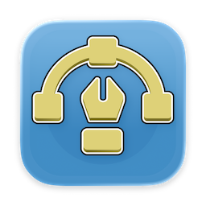
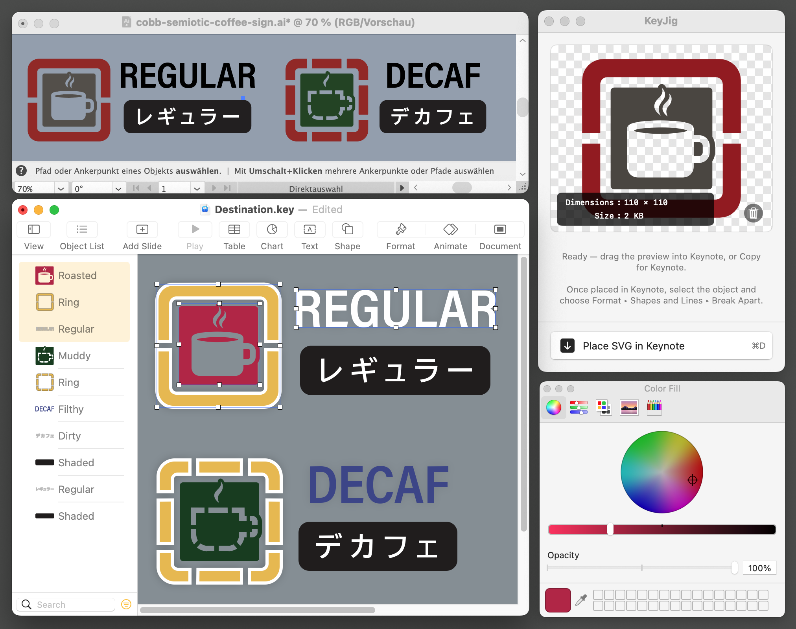
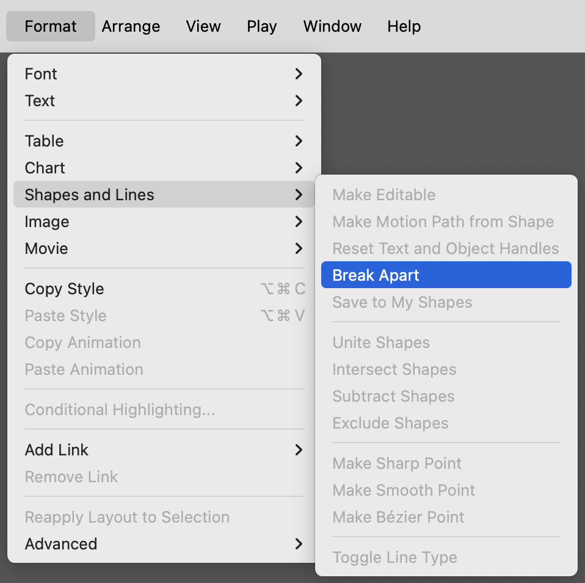
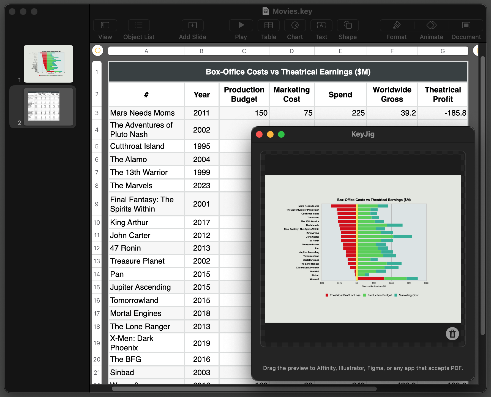
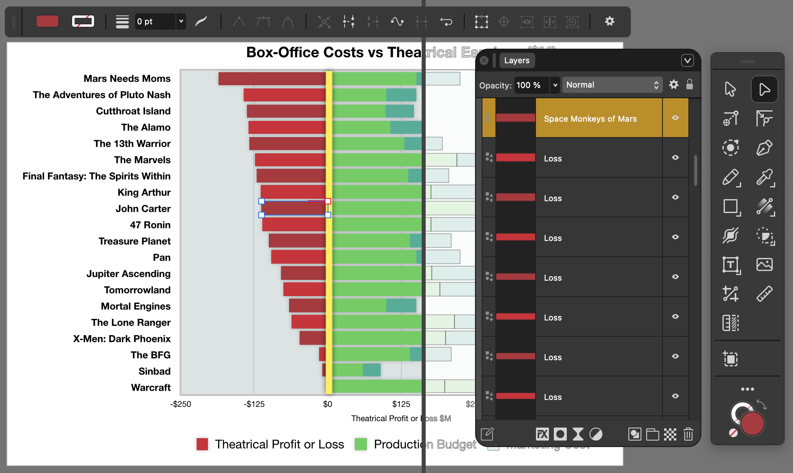
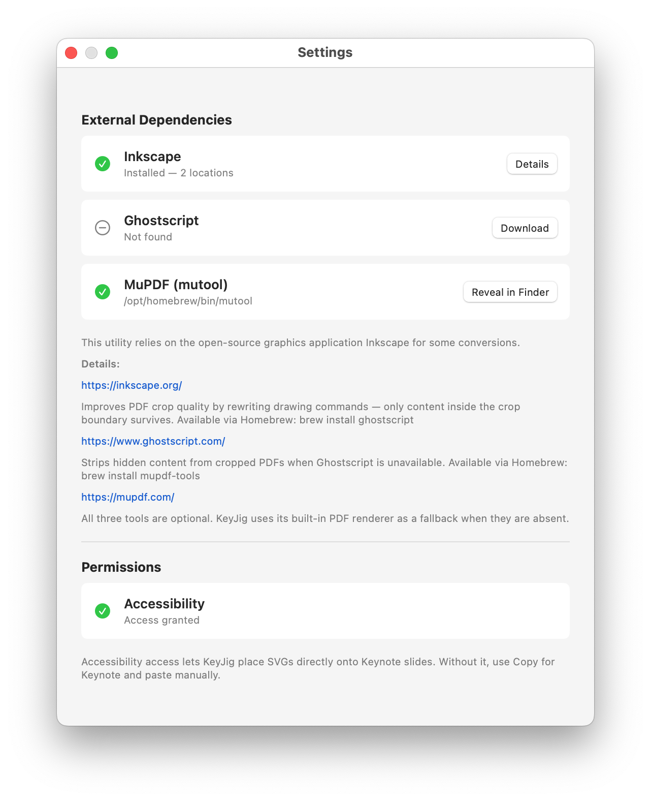

# KeyJig



**Bridge editable vector graphics into — and out of — Apple Keynote.**

KeyJig is a Mac utility that sits between your vector tools and Apple Keynote. It sends vector artwork onto a Keynote slide as editable paths, and extracts vector content from a slide for desktop publishing or external editing.

[](https://opensource.org/licenses/MIT)
[](#installation)
[](https://github.com/Cyzor/KeyJig/releases/latest)

---

## Why it exists

Keynote 13.1+ has a native SVG importer, but copying and pasting from Illustrator or Affinity Designer sends Keynote a flattened, uneditable PDF. KeyJig re-encodes the artwork so Keynote imports it as native, editable paths you can Break Apart and modify freely.

KeyJig also extracts graphics (charts, tables, and whole slides) from Keynote as high-quality PDFs for desktop publishing or external editing.

---

## Workflows

### Send artwork to Keynote


1. **Copy** vector artwork in Illustrator, Affinity Designer, or any app that copies vector graphics to the clipboard (`⌘C`).
2. **Switch** to KeyJig, which detects and converts it automatically. Alternatively, drag the artwork directly onto the KeyJig icon in the menu bar.
3. **Send it to Keynote** in any of three ways:
   - **Drag** the preview directly onto a slide.
   - **⌘K** (or right-click the preview) to copy it to the clipboard, then paste in Keynote (`⌘V`).
   - **⌘D / Place in Keynote** to insert it onto the current slide automatically.
4. **Break Apart** in Keynote via *Format → Shapes and Lines → Break Apart* (or right-click the object). The paths are now native Keynote shapes — adjust color, stroke, and anchor points freely.

### Pull content from Keynote

Copying graphics from Keynote tends to result in a low-resolution raster version that looks worse than the original. Exporting the whole presentation as a separate PDF is often the most reliable way to retain high-quality vector charts, tables, and graphics.

KeyJig provides a faster way to extract standalone graphics:

- **Select & Copy Slide in Navigator** — automatically presents a standalone version of the copied slide in the preview. Drag directly into Adobe InDesign, Affinity, or the Finder.
- **⌘R / Convert Keynote Slide to PDF** — exports the current Keynote slide as a vector PDF and loads it into the preview.
- **⌘E / Convert Keynote Clipboard to PDF** — select one or more items on a Keynote slide and copy them to the clipboard. Then activate KeyJig and press **⌘E** to import them.

*Note: Some actions rely on AppleScript to communicate with Keynote, which requires permission within **Privacy & Security** in System Settings. Hold down **Option** to reveal these hidden buttons.*

---

## Screenshots


_Workflow: Adobe Illustrator → KeyJig → Apple Keynote:_


_Keynote > Format > Shapes and Lines > Break Apart:_


_Keynote Chart Export:_


_Affinity PDF Editing:_


_App Settings:_

---

## Installation

### Requirements

- macOS 11.5 (Big Sur) or later
- Keynote 13.1 or later — the June 2023 iWork update that added native SVG import (itself requiring macOS 12.3), available free from the Mac App Store. Numbers and Pages support the same SVG format and work identically. Pulling slides or selections *from* Keynote also works on somewhat older versions, but KeyJig is developed and tested against Keynote 14.5; sending SVG to an older Keynote is blocked with an explanatory message.
- Two permissions in System Settings → Privacy & Security:
  - **Accessibility** — required to place SVGs directly onto slides (⌘D)
  - **Automation** — required to pull slides and selections from Keynote; macOS prompts on first use
- Optional external tools for additional format support (all available via [Homebrew](https://brew.sh)):
  - [Inkscape](https://inkscape.org/) — opens PDF and `.ai` files (`brew install inkscape`)
  - [Ghostscript](https://www.ghostscript.com/) — higher-quality PDF cropping (`brew install ghostscript`)
  - [MuPDF](https://mupdf.com/) — alternative to Ghostscript (`brew install mupdf-tools`)

### Download

Download the latest signed and notarized build from [Releases](https://github.com/Cyzor/KeyJig/releases/latest). Drag the app into `/Applications` and open it.

### Build from Source

```bash
git clone https://github.com/cyzor/KeyJig.git
```

Open `KeyJig.xcodeproj` in Xcode, select the **KeyJig** scheme, and Build (`⌘B`) or Run (`⌘R`).

---

## Features

- **Clipboard auto-detect** — the preview updates the moment an SVG lands on the clipboard, so switching to KeyJig from your drawing app is all it takes.
- **Menu bar drop target** — drag artwork directly onto the KeyJig menu bar icon to load it without opening the main window.
- **Drag-and-drop send** — drag the preview straight onto a Keynote slide.
- **Place in Keynote** — drops the SVG onto the current Keynote slide directly, no manual paste needed.
- **Pull Slide** — exports the current Keynote slide as a vector PDF.
- **Extract Selection** — extracts only the selected Keynote objects as a clean vector PDF; non-contiguous selections work correctly.
- **PDF/AI conversion** — converts PDF and Adobe Illustrator files to SVG via Inkscape when Keynote's native importer isn't enough.
- **File open** — load an SVG file directly.  Support for additional vector formats may vary depending on system configuration.
- **Multiple windows** — open independent viewer windows for side-by-side work.
- **AppleScript** — multiple commands covering conversion, file import/export, and window control.
- **No bundled code** — KeyJig is a Swift app containing no third-party packages or frameworks.  However, it can call Inkscape, Ghostscript, and MuPDF for more sophisticated conversion support.

---

## AppleScript

KeyJig supports scripted conversions, file operations, and window management from AppleScript.

```applescript
tell application "KeyJig"
    load SVG file "/Users/john/Documents/design.svg"
    convert
end tell
```

See [**docs/applescript.md**](./docs/applescript.md) for the full command reference, or open the dictionary in Script Editor via *File → Open Dictionary → KeyJig*.

---

## Permissions

- **Accessibility access** — required for Place in Keynote (⌘D). Grant it in System Settings → Privacy & Security → Accessibility.
- **Automation access** — required for all Keynote communication (Pull Slide, Extract Selection). macOS prompts on first use; it only reappears in Settings if you revoke it.
- **No sandbox** — KeyJig runs outside the App Sandbox so it can call Inkscape and write temporary files.

KeyJig is a signed and notarized app that uses a Hardened Runtime environment.

---

## Documentation

- [**user_guide.md**](./docs/user_guide.md) — installation, usage modes, drag and drop, troubleshooting
- [**applescript.md**](./docs/applescript.md) — AppleScript command reference
- [**scripting_implementation.md**](./docs/scripting_implementation.md) — developer notes on the scripting layer

---

## Acknowledgments

KeyJig draws inspiration from [**SVG2Keynote**](https://github.com/eth-siplab/SVG2Keynote-gui) by [Jonathan Lampérth](https://www.linkedin.com/in/jonathan-lamperth-7059b418a) and [Christian Holz](https://www.christianholz.net) at the [Sensing, Interaction & Perception Lab](https://siplab.org), ETH Zürich. Where SVG2Keynote writes Keynote's native file format directly, KeyJig drives Keynote's built-in SVG importer instead.

KeyJig optionally delegates certain operations to three open-source command-line tools it auto-detects on your system. None are bundled or distributed with the app:

- [**Inkscape**](https://inkscape.org/) — PDF and `.ai` → SVG conversion.
- [**Ghostscript**](https://www.ghostscript.com/) — high-fidelity PDF crop and rewrite.
- [**MuPDF**](https://mupdf.com/) — lightweight alternative to Ghostscript for the same crop operations.

None are required. KeyJig works without them; they expand what it can do.

---

## License

MIT License. See [LICENSE](./LICENSE).